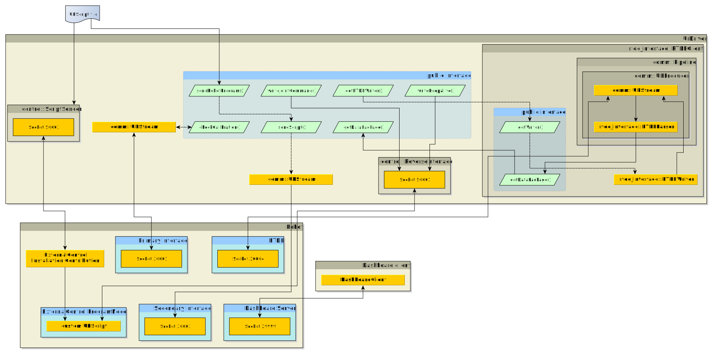

# Universal Robots Client Library
   * [Universal Robots Client Library](#universal-robots-client-library)
      * [Requirements](#requirements)
      * [Build instructions](#build-instructions)
         * [Plain cmake](#plain-cmake)
         * [Inside a ROS workspace](#inside-a-ros-workspace)
      * [Use this library in other projects](#use-this-library-in-other-projects)
      * [License](#license)
      * [Library contents](#library-contents)
      * [Example driver](#example-driver)
      * [Architecture](#architecture)
         * [RTDEClient](#rtdeclient)
            * [RTDEWriter](#rtdewriter)
         * [ReverseInterface](#reverseinterface)
         * [ScriptSender](#scriptsender)
         * [Other public interface functions](#other-public-interface-functions)
            * [check_calibration()](#check_calibration)
            * [sendScript()](#sendscript)
         * [DashboardClient](#dashboardclient)
      * [A word on the primary / secondary interface](#a-word-on-the-primary--secondary-interface)
      * [A word on Real-Time scheduling](#a-word-on-real-time-scheduling)
      * [Producer / Consumer architecture](#producer--consumer-architecture)
      * [Logging configuration](#logging-configuration)
         * [Change logging level](#change-logging-level)
         * [Create new log handler](#create-new-log-handler)
         * [Console_bridge](#console_bridge)
      * [Acknowledgement](#acknowledgement)


A C++ library for accessing Universal Robots interfaces. With this library C++-based drivers can be
implemented in order to create external applications leveraging the versatility of Universal Robots
robotic manipulators.

## Requirements
 * **Polyscope** (The software running on the robot controller) version **3.12.0** (for CB3-Series),
   or **5.5.1** (for e-Series) or higher. If you use an older Polyscope version it is suggested to
   update your robot. If for some reason (please tell us in the issues why) you cannot upgrade your
   robot, please see the [version compatibility table](doc/polyscope_compatibility.md) for a
   compatible tag.
 * The library requires an implementation of **POSIX threads** such as the `pthread` library
 * Socket communication is currently based on Linux sockets. Thus, this library will require Linux
   for building and using.
 * The [master](https://github.com/UniversalRobots/Universal_Robots_Client_Library/tree/master)
   branch of this repository requires a C++17-compatible compiler. For building this library without
   a C++17-requirement, please use the
   [boost](https://github.com/UniversalRobots/Universal_Robots_Client_Library/tree/boost) branch
   instead that requires the boost library.
   For the C++17 features, please use those minimum compiler versions:

   | Compiler  | min. version |
   |-----------|--------------|
   | **GCC**   | 7            |
   | **Clang** | 7            |


## Build instructions
### Plain cmake
To build this library standalone so that you can build you own applications using this library,
follow the usual cmake procedure:
```bash
cd <clone of this repository>
mkdir build && cd build
cmake ..
make
sudo make install
```

This will install the library into your system so that it can be used by other cmake projects
directly.

### Inside a ROS workspace
If you want to build this library inside a ROS workspace, e.g. because you want to build the
[Universal Robots ROS driver](https://github.com/UniversalRobots/Universal_Robots_ROS_Driver) from
source, you cannot use `catkin_make` directly, as this library is not a catkin package. Instead, you
will have to use
[`catkin_make_isolated`](http://docs.ros.org/independent/api/rep/html/rep-0134.html) or [catkin
build](https://catkin-tools.readthedocs.io/en/latest/verbs/catkin_build.html) to build your
workspace.

## Use this library in other projects
When you want to use this library in other cmake projects, make sure to
 * Add `find_package(ur_client_library REQUIRED)` to your `CMakeLists.txt`
 * add `ur_client_library::urcl` to the list of `target_link_libraries(...)` commands inside your
   CMakeLists.txt file

As a minimal example, take the following "project":
```c++
/*main.cpp*/

#include <iostream>
#include <ur_client_library/ur/dashboard_client.h>

int main(int argc, char* argv[])
{
  urcl::DashboardClient my_client("192.168.56.101");
  bool connected = my_client.connect();
  if (connected)
  {
    std::string answer = my_client.sendAndReceive("PolyscopeVersion\n");
    std::cout << answer << std::endl;
    my_client.disconnect();
  }
  return 0;
}

```

```cmake
# CMakeLists.txt

cmake_minimum_required(VERSION 3.0.2)
project(minimal_example)

find_package(ur_client_library REQUIRED)
add_executable(db_client main.cpp)
target_link_libraries(db_client ur_client_library::urcl)
```

## License
The majority of this library is licensed under the Apache-2.0 licensed. However, certain parts are
licensed under different licenses:
 - The queue used inside the communication structures is originally written by Cameron Desrochers
   and is released under the BSD-2-Clause license.
 - The semaphore implementation used inside the queue implementation is written by Jeff Preshing and
   licensed under the zlib license
 - The Dockerfile used for the integration tests of this repository is originally written by Arran
   Hobson Sayers and released under the MIT license

While the main `LICENSE` file in this repository contains the Apache-2.0 license used for the
majority of the work, the respective libraries of third-party components reside together with the
code imported from those third parties.

## Library contents
Currently, this library contains the following components:
 * **Basic primary interface:** The primary interface isn't fully implemented at the current state
   and provides only basic functionality. See [A word on the primary / secondary
   interface](#a-word-on-the-primary--secondary-interface) for further information about the primary
   interface.
 * **RTDE interface:** The [RTDE interface](https://www.universal-robots.com/articles/ur-articles/real-time-data-exchange-rtde-guide/)
   is fully supported by this library. See [RTDEClient](#rtdeclient) for further information on how
   to use this library as an RTDE client.
 * **Dashboard interface:** The [Dashboard server](https://www.universal-robots.com/articles/ur-articles/dashboard-server-e-series-port-29999/) can be accessed directly from C++ through helper functions using this library.
 * **Custom motion streaming:** This library was initially developed as part of the [Universal
   Robots ROS driver](https://github.com/UniversalRobots/Universal_Robots_ROS_Driver). Therefore, it
   also contains a mechanism to do data streaming through a custom socket, e.g. to perform motion
   command streaming.

## Example driver
In the `examples` subfolder you will find a minimal example of a running driver. It starts an
instance of the `UrDriver` class and prints the RTDE values read from the controller. To run it make
sure to
 * have an instance of a robot controller / URSim running at the configured IP address (or adapt the
   address to your needs)
 * run it from the package's main folder (the one where this README.md file is stored), as for
   simplicity reasons it doesn't use any sophisticated method to locate the required files.

## Architecture
The image below shows a rough architecture overview that should help developers to use the different
modules present in this library. Note that this is an incomplete view on the classes involved.

[](doc/dataflow.svg)

The core of this library is the `UrDriver` class which creates a
fully functioning robot interface. For details on how to use it, please see the [Example
driver](#example-driver) section.

The `UrDriver`'s modules will be explained in the following.

### RTDEClient
The `RTDEClient` class serves as a standalone
[RTDE](https://www.universal-robots.com/articles/ur-articles/real-time-data-exchange-rtde-guide/)
client. To use the RTDE-Client, you'll have to initialize and start it separately:

```c++
rtde_interface::RTDEClient my_client(ROBOT_IP, notifier, OUTPUT_RECIPE, INPUT_RECIPE);
my_client.init();
my_client.start();
while (true)
{
  std::unique_ptr<rtde_interface::DataPackage> data_pkg = my_client.getDataPackage(READ_TIMEOUT);
  if (data_pkg)
  {
    std::cout << data_pkg->toString() << std::endl;
  }
}
```

Upon construction, two recipe files have to be given, one for the RTDE inputs, one for the RTDE
outputs. Please refer to the [RTDE
guide](https://www.universal-robots.com/articles/ur-articles/real-time-data-exchange-rtde-guide/)
on which elements are available.

Inside the `RTDEclient` data is received in a separate thread, parsed by the `RTDEParser` and added
to a pipeline queue.

Right after calling `my_client.start()`, it should be made sure to read the buffer from the
`RTDEClient` by calling `getDataPackage()` frequently. The Client's queue can only contain 1 item
at a time, so a `Pipeline producer overflowed!` error will be raised if the buffer isn't read before
the next package arrives.

For writing data to the RTDE interface, use the `RTDEWriter` member of the `RTDEClient`. It can be
retrieved by calling `getWriter()` method. The `RTDEWriter` provides convenience methods to write
all data available at the RTDE interface. Make sure that the required keys are configured inside the
input recipe, as otherwise the send-methods will return `false` if the data field is not setup in
the recipe.

An example of a standalone RTDE-client can be found in the `examples` subfolder. To run it make
sure to
 * have an instance of a robot controller / URSim running at the configured IP address (or adapt the
   address to your needs)
 * run it from the package's main folder (the one where this README.md file is stored), as for
   simplicity reasons it doesn't use any sophisticated method to locate the required files.

#### RTDEWriter
The `RTDEWriter` class provides an interface to write data to the RTDE interface. Data fields that
should be written have to be defined inside the `INPUT_RECIPE` as noted above.

The class offers specific methods for every RTDE input possible to write.

Data is sent asynchronously to the RTDE interface.

### ReverseInterface
The `ReverseInterface` opens a TCP port on which a custom protocol is implemented between the
robot and the control PC. The port can be specified in the class constructor.

It's basic functionality is to send a vector of floating point data together with a mode. It is
meant to send joint positions or velocities together with a mode that tells the robot how to
interpret those values (e.g. `SERVOJ`, `SPEEDJ`). Therefore, this interface can be used to do motion
command streaming to the robot.

In order to use this class in an application together with a robot, make sure that a corresponding
URScript is running on the robot that can interpret the commands sent. See [this example
script](resources/external_control.urscript) for reference.

Also see the [ScriptSender](#scriptsender) for a way to define the corresponding URScript on the
control PC and sending it to the robot upon request.

### ScriptSender

The `ScriptSender` class opens a tcp socket on the remote PC whose single purpose it is to answer
with a URScript code snippet on a "*request_program*" request. The script code itself has to be
given to the class constructor.

Use this class in conjunction with the [**External Control**
URCap](https://github.com/UniversalRobots/Universal_Robots_ExternalControl_URCap) which will make
the corresponding request when starting a program on the robot that contains the **External
Control** program node. In order to work properly, make sure that the IP address and script sender
port are configured correctly on the robot.

### Other public interface functions
This section shall explain the public interface functions that haven't been covered above

#### `check_calibration()`
This function opens a connection to the primary interface where it will receive a calibration
information as the first message. The checksum from this calibration info is compared to the one
given to this function. Connection to the primary interface is dropped afterwards.

#### `sendScript()`
This function sends given URScript code directly to the secondary interface. The
`sendRobotProgram()` function is a special case that will send the script code given in the
`RTDEClient` constructor.

### DashboardClient
The `DashboardClient` wraps the calls on the [Dashboard server](https://www.universal-robots.com/articles/ur-articles/dashboard-server-e-series-port-29999/) directly into C++ functions.

After connecting to the dashboard server by using the `connect()` function, dashboard calls can be
sent using the `sendAndReceive()` function. Answers from the dashboard server will be returned as
string from this function. If no answer is received, a `UrException` is thrown.

Note: In order to make this more useful developers are expected to wrap this bare interface into
something that checks the returned string for something that is expected. See the
[DashboardClientROS](https://github.com/UniversalRobots/Universal_Robots_ROS_Driver/blob/master/ur_robot_driver/include/ur_robot_driver/dashboard_client_ros.h) as an example.

## A word on the primary / secondary interface
Currently, this library doesn't support the primary interface very well, as the [Universal Robots
ROS driver](https://github.com/UniversalRobots/Universal_Robots_ROS_Driver) was built mainly upon
the RTDE interface. Therefore, there is also no `PrimaryClient` for directly accessing the primary
interface. This may change in future, though.

The `comm::URStream` class can be used to open a connection to the primary / secondary interface and
send data to it. The [producer/consumer](#producer--consumer-architecture) pipeline structure can also be used
together with the primary / secondary interface. However, package parsing isn't implemented for most
packages currently. See the [`primary_pipeline` example](examples/primary_pipeline.cpp) on details
how to set this up. Note that when running this example, most packages will just be printed as their
raw byte streams in a hex notation, as they aren't implemented in the library, yet.

## A word on Real-Time scheduling
As mentioned above, for a clean operation it is quite critical that arriving RTDE messages are read
before the next message arrives. Due to this, both, the RTDE receive thread and the thread calling
`getDataPackage()` should be scheduled with real-time priority. See [this guide](doc/real_time.md)
for details on how to set this up.

The RTDE receive thread will be scheduled to real-time priority automatically, if applicable. If
this doesn't work, an error is raised at startup. The main thread calling `getDataPackage` should be
scheduled to real-time priority by the application. See the
[ur_robot_driver](https://github.com/UniversalRobots/Universal_Robots_ROS_Driver/blob/master/ur_robot_driver/src/hardware_interface_node.cpp)
as an example.

## Producer / Consumer architecture
Communication with the primary / secondary and RTDE interfaces is designed to use a
consumer/producer pattern. The Producer reads data from the socket whenever it comes in, parses the
contents and stores the parsed packages into a pipeline queue.
You can write your own consumers that use the packages coming from the producer. See the
[`comm::ShellConsumer`](include/ur_client_library/comm/shell_consumer.h) as an example.

## Logging configuration
As this library was originally designed to be included into a ROS driver but also to be used as a
standalone library, it uses custom logging macros instead of direct `printf` or `std::cout`
statements.

The macro based interface is by default using the [`DefaultLogHandler`](include/ur_client_library/default_log_handler.h)
to print the logging messages as `printf` statements. It is possible to define your own log handler
to change the behavior, [see create new log handler](#Create-new-log-handler) on how to.

### Change logging level
Make sure to set the logging level in your application, as by default only messages of level
WARNING or higher will be printed. See below for an example:
```c++
#include "ur_client_library/log.h"

int main(int argc, char* argv[])
{
  urcl::setLogLevel(urcl::LogLevel::DEBUG);

  URCL_LOG_DEBUG("Logging debug message");
  return 0;
}
```

### Create new log handler
The logger comes with an interface [`LogHandler`](include/ur_client_library/log.h), which can be
used to implement your own log handler for messages logged with this library. This can be done by
inheriting from the `LogHandler class`.

If you want to create a new log handler in your application, you can use below example as
inspiration:

```c++
#include "ur_client_library/log.h"
#include <iostream>

class MyLogHandler : public urcl::LogHandler
{
public:
  MyLogHandler() = default;

  void log(const char* file, int line, urcl::LogLevel loglevel, const char* log) override
  {
    switch (loglevel)
    {
      case urcl::LogLevel::INFO:
        std::cout << "INFO " << file << " " << line << ": " << log << std::endl;
        break;
      case urcl::LogLevel::DEBUG:
        std::cout << "DEBUG " << file << " " << line << ": " << log << std::endl;
        break;
      case urcl::LogLevel::WARN:
        std::cout << "WARN " << file << " " << line << ": " << log << std::endl;
        break;
      case urcl::LogLevel::ERROR:
        std::cout << "ERROR " << file << " " << line << ": " << log << std::endl;
        break;
      case urcl::LogLevel::FATAL:
        std::cout << "ERROR " << file << " " << line << ": " << log << std::endl;
        break;
      default:
        break;
    }
  }
};

int main(int argc, char* argv[])
{
  urcl::setLogLevel(urcl::LogLevel::DEBUG);
  std::unique_ptr<MyLogHandler> log_handler(new MyLogHandler);
  urcl::registerLogHandler(std::move(log_handler));

  URCL_LOG_DEBUG("logging debug message");
  URCL_LOG_INFO("logging info message");
  return 0;
}
```

## Acknowledgment
Many parts of this library are forked from the [ur_modern_driver](https://github.com/ros-industrial/ur_modern_driver).

Developed in collaboration between:

[](https://www.universal-robots.com/) &nbsp; and &nbsp;
[](https://www.fzi.de).

<!--
    ROSIN acknowledgement from the ROSIN press kit
    @ https://github.com/rosin-project/press_kit
-->

<a href="http://rosin-project.eu">
  
</a>

Supported by ROSIN - ROS-Industrial Quality-Assured Robot Software Components.
More information: <a href="http://rosin-project.eu">rosin-project.eu</a>


This project has received funding from the European Union’s Horizon 2020
research and innovation programme under grant agreement no. 732287.
