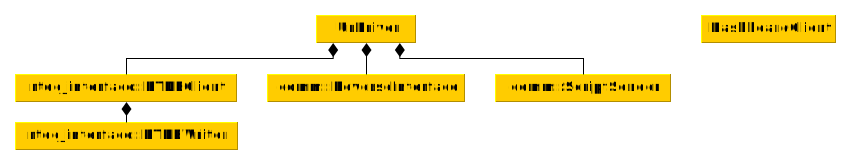

#ur_lib

A C++ library for accessing Universal Robots interfaces. With this library C++-based drivers can be
implemented in order to create external applications leveraging the versatility of Universal Robots
robotic manipulators.

## Library contents
Currently, this library contains the following components:
 * **Basic primary interface:** The primary interface isn't fully implemented at the current state
   and provides only basic functionality. See **TODO** for further information about the primary
   interface.
 * **RTDE interface:** The [RTDE interface](https://www.universal-robots.com/articles/ur-articles/real-time-data-exchange-rtde-guide/)
   is fully supported by this library. See **TODO** for further information on how to use this
   library as an RTDE client.
 * **Dashboard interface:** The [Dashboard server](https://www.universal-robots.com/articles/ur-articles/dashboard-server-e-series-port-29999/) can be accessed directly from C++ through helper functions using this library.
 * **Custom motion streaming:** This library was initially developed as part of the [Universal
   Robots ROS driver](https://github.com/UniversalRobots/Universal_Robots_ROS_Driver). Therefore, it
   also contains a mechanism to do data streaming through a custom socket, e.g. to perform motion
   command streaming.

## Example driver
In the `examples` subfolder you will find a minimal example of a running driver. It starts an
instance of the `UrDriver` class and prints the RTDE values read from the controller. To run it make
sure to
 * have an instance of a robot controller / URSim running at the configured IP address (or adapt the
   address to your needs)
 * run it from its source folder, as for simplicity reasons it doesn't use any sophisticated method
   to locate the required files.

## Architecture
The image below shows a rough architecture overview that should help developers to use the different
modules present in this library. Note that this is a very incomplete view on the classes involved.
This representation includes only the classes relevant for library users.



The core of this library is the `UrDriver` class which creates a
fully functioning robot interface. For details on how to use it, please see the [Example
driver](#example_driver) section.

The `UrDriver`'s modules will be explained in the following.

### RTDEClient
The `RTDEClient` class serves as a standalone
[RTDE](https://www.universal-robots.com/articles/ur-articles/real-time-data-exchange-rtde-guide/)
client. To use the RTDE-Client, you'll have to initialize and start it separately:

```c++
rtde_interface::RTDEClient my_client(ROBOT_IP, notifier, OUTPUT_RECIPE, INPUT_RECIPE);
my_client.init();
my_client.start();
while (true)
{
  std::unique_ptr<rtde_interface::DataPackage> data_pkg = my_client.getDataPackage(READ_TIMEOUT);
  if (data_pkg)
  {
    std::cout << data_pkg->toString() << std::endl;
  }
}
```

Upon construction, two recipe files have to be given, one for the RTDE inputs, one for the RTDE
outputs. Please refer to the [RTDE
guide](https://www.universal-robots.com/articles/ur-articles/real-time-data-exchange-rtde-guide/)
on which elements are available.

Right after calling `my_client.start()`, it should be made sure to read the buffer from the
`RTDEClient` by calling `getDataPackage()` frequently. The Client's buffer can only contain 1 item
at a time, so a `Pipeline producer overflowed!` error will be raised if the buffer isn't read before
the next package arrives.

For writing data to the RTDE interface, use the `RTDEWriter` member of the `RTDEClient`. It can be
retrieved by calling `getWriter()` method. The `RTDEWriter` provides convenience methods to write
all data available at the RTDE interface. Make sure that the required keys are configured inside the
input recipe, as otherwise the send-methods will return `false` if the data field is not setup in
the recipe.

An example of a standalone RTDE-client can be found in the `examples` subfolder. To run it make
sure to
 * have an instance of a robot controller / URSim running at the configured IP address (or adapt the
   address to your needs)
 * run it from its source folder, as for simplicity reasons it doesn't use any sophisticated method
   to locate the required recipe files.

## A word on Real-Time scheduling
As mentioned above, for a clean operation it is quite critical that arriving RTDE messages are read
before the next message arrives. Due to this, both, the RTDE receive thread and the thread calling
`getDataPackage()` should be scheduled with real-time priority. See **TODO: migrate from driver**
for details on how to set this up.

The RTDE receive thread will be scheduled to real-time priority automatically, if applicable. If
this doesn't work, an error is raised at startup. The main thread calling `getDataPackage` should be
scheduled to real-time priority by the application. See the
[ur_robot_driver](https://github.com/UniversalRobots/Universal_Robots_ROS_Driver/blob/master/ur_robot_driver/src/ros/hardware_interface_node.cpp)
as an example.
